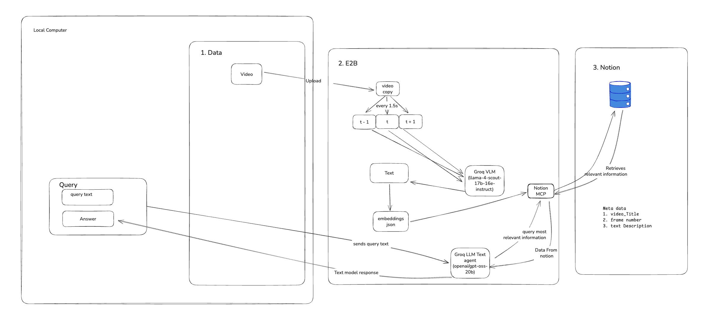

# Semantic video search

A Streamlit application that processes videos inside E2B sandboxes, analyzes frames with Groq's vision/language models, and reads/writes data to Notion using MCP - all running within the E2B environment.

## Why Use This?

- **Stay in context with your video data** - Retrieve relevant frames based on semantic search, no need to rewatch entire videos
- **Privacy-first approach** - No need to upload private data to external services; all processing happens via secure API calls within E2B sandboxes
- **Intelligent frame retrieval** - Find specific moments, detect duplicate frames, and query your video content naturally
- **Persistent knowledge base** - Video analysis is stored in Notion, making it searchable and reusable

## Future Improvements

- **Audio Modality** - Incorporate speech-to-text when creating embeddings for richer context
- **Video Recommendation System** - Suggest related videos based on content similarity
- **Semantic Clip Search** - Search across a catalogue of images and videos
- **Video QA & Interactive Understanding** - Enhanced conversational interface for video content
- **Data Cleaning for Video ML Training** - Identify and remove duplicate frames, low-quality segments
- **Vector Database Integration** - Store embeddings for faster similarity search and retrieval

## Architecture

```
┌─────────────────────────────────────────────────────────┐
│                      E2B Sandbox                        │
│  ┌─────────────┐    ┌─────────────┐    ┌─────────────┐  │
│  │   OpenCV    │───▶│    Groq     │───▶│  MCP Client │  │
│  │   (Frames)  │    │  (VLM/LLM)  │    │  (Notion)   │  │
│  └─────────────┘    └─────────────┘    └─────────────┘  │
└─────────────────────────────────────────────────────────┘
              ▲                                  │
              │                                  ▼
        ┌───────────┐                    ┌─────────────┐
        │ Streamlit │                    │   Notion    │
        │    App    │                    │  (Storage)  │
        └───────────┘                    └─────────────┘
```

## Visual Overview

### System Flowchart


### Demo Video
[Watch the demo](demo.mp4)

## How It Works

### Everything Runs Inside E2B

1. **E2B Sandbox** - Secure cloud environment that:
   - Receives the video file
   - Runs OpenCV for frame extraction
   - Calls Groq API for AI analysis
   - Connects to Notion via MCP

2. **Groq (Inside E2B)** - AI processing:
   - **VLM (Vision)**: `llama-4-scout-17b` analyzes frame triplets (before/current/after)
   - **LLM (Text)**: `llama-3.1-8b-instant` powers the chat interface

3. **MCP Connection (Inside E2B)** - Notion integration:
   - E2B provides MCP URL and token
   - MCP client connects to Notion from within the sandbox
   - **Writes**: Frame descriptions with timestamps to Notion pages
   - **Reads**: Fetches stored analysis for chat queries

### Processing Flow

```
Video Upload → E2B Sandbox Created
                    ↓
            Frame Extraction (OpenCV)
                    ↓
            Frame Analysis (Groq VLM) ← runs inside E2B
                    ↓
            Save to Notion (MCP) ← runs inside E2B
                    ↓
               Sandbox Killed
```

### Chat Flow

```
User Question → E2B Sandbox Created
                      ↓
              Read from Notion (MCP) ← runs inside E2B
                      ↓
              Generate Answer (Groq LLM) ← runs locally
                      ↓
                 Sandbox Killed
```

## Features

- **Tab 1 - Process Video**: Upload files or YouTube URLs, analyze frames, save to Notion
- **Tab 2 - Chat**: Query your video knowledge with timestamp citations

## Prerequisites & API Setup

### 1. E2B API Key
E2B provides secure cloud sandboxes for code execution.
- Sign up at [e2b.dev](https://e2b.dev)
- Go to Dashboard → API Keys
- Generate and copy your API key

### 2. Groq API Key
Groq provides fast inference for LLaMA models.
- Sign up at [console.groq.com](https://console.groq.com)
- Navigate to API Keys section
- Create a new API key

### 3. Notion Integration Setup
Notion requires an integration to allow API access.

**Step 1: Create Integration**
- Go to [notion.so/my-integrations](https://www.notion.so/my-integrations)
- Click "New integration"
- Give it a name (e.g., "Video Analyzer")
- Select your workspace
- Copy the "Internal Integration Token"

**Step 2: Connect Integration to Page**
- Open the Notion page where you want to save video analysis
- Click the `•••` menu (top right)
- Select "Add connections"
- Find and add your integration

**Step 3: Get Page ID**
- Open the page in Notion
- Copy the URL: `https://notion.so/Your-Page-Title-abc123def456`
- The Page ID is the 32-character string at the end (without hyphens): `abc123def456...`

## Installation

```bash
pip install streamlit python-dotenv e2b yt-dlp mcp groq pillow
```

Create `.env`:
```env
E2B_API_KEY=your_e2b_key
GROQ_API_KEY=your_groq_key
NOTION_INTEGRATION_TOKEN=your_notion_token
NOTION_PAGE_ID=your_page_id
```

## Run

```bash
streamlit run main.py
```

## Tech Stack

| Component | Technology | Where it Runs |
|-----------|------------|---------------|
| UI | Streamlit | Local |
| Sandbox | E2B | Cloud |
| Frame Extraction | OpenCV | Inside E2B |
| Vision AI | Groq VLM | Inside E2B |
| Chat AI | Groq LLM | Local |
| Data Storage | Notion via MCP | Inside E2B |

---

Built with E2B • Notion MCP • Groq • Streamlit
